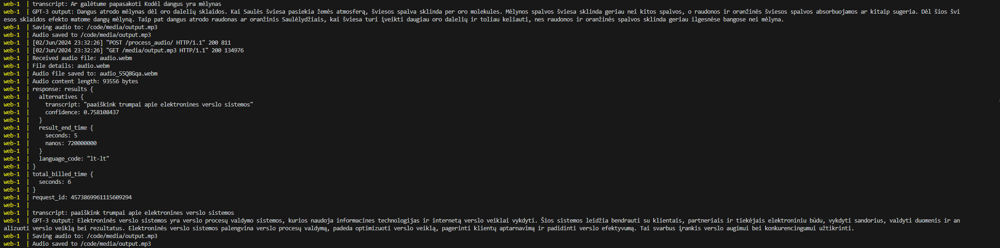

# Voice-Controlled Chatbot

## Demo

### Video demo
https://github.com/PovilasUrb/Speech_To_GPT_To_Speech/assets/32778303/28bc21cb-4153-49e9-9485-11cd95bf8d96

### Backend requests


## Purpose
To create a voice-controlled chatbot that can respond to customer queries in Lithuanian using Google Cloud platform tools.

## Task Description
The chatbot uses Google Speech-to-Text and Text-to-Speech technologies for the Lithuanian language and GPT-3.5 from OpenAI for understanding and answering questions. The bot is capable of recognizing user speech, understanding basic queries, and responding in voice.


## Project Stages

### 1. Preparation
- **Registration and Environment Setup**: Register and create a project on the Google Cloud platform.
- **API Keys**: Enable Speech-to-Text and Text-to-Speech APIs and obtain keys for API usage.

### 2. Voice Recognition Integration
- **Speech Recognition**: Configure the Google Speech-to-Text API to recognize Lithuanian.
- **Choosing a Dialog Management Tool**: Select and configure Dialogflow or another NLP tool to process the received text and determine user intents.

### 3. Dialog Creation
- **Defining Intents and Responses**: Define the main intents the chatbot should understand and create corresponding responses.
- **Scenario Creation**: Create several dialog scenarios for the chatbot to interact with users.

### 4. Text-to-Speech Conversion
- **Speech Synthesis**: Integrate the Text-to-Speech technology to enable the bot to respond to the user in voice.

### 5. Testing and Refinement
- **Bot Testing**: Test the chatbot in various situations and with different types of queries.
- **Analysis and Error Correction**: Analyze how the bot recognizes speech and responds to queries, and improve its performance.

## Installation and Setup

### Prerequisites
- Docker
- Docker Compose

### Environment Variables
`.env` file contains the following items and API keys **need** to be adjusted for your use case. The file contains these variables:

```bash
GOOGLE_API_KEY=API-KEY
OPENAI_API_KEY=API-KEY
POSTGRES_DB=chatbot
POSTGRES_USER=user
POSTGRES_PASSWORD=password
DEBUG=True
```

### Steps to Run the Project

1. **Clone the Repository**
    ```sh
    git clone https://github.com/PovilasUrb/Speech_To_GPT_To_Speech
    cd Speech_To_GPT_To_Speech
    ```

2. **Build and Start the Docker Containers**
    ```sh
    docker-compose up --build
    ```

    This command will build and start the following services:
    - `web`: The Django application server.
    - `db`: The PostgreSQL database server.

3. **Run Database Migrations**
    After the containers are up and running, open a new terminal and run:
    ```sh
    docker-compose exec web python manage.py migrate
    ```

4. **Access the Application**
    Open your web browser and navigate to `http://localhost:8000`.

5. **Interact with the Chatbot**
    - Click "Record" to start recording your query.
    - Click "Stop" to send your query.
    - The chatbot will process your speech, generate a response using GPT-3, and reply in voice.

### Project Structure

- `app/`: Contains the main application code.
- `app/templates/`: HTML templates for the web interface.
- `media/`: Directory where media files (e.g., audio responses) are stored.
- `requirements.txt`: List of Python dependencies.
- `docker-compose.yml`: Docker Compose configuration file.
- `Dockerfile`: Docker configuration for the web service.
- `.env`: Environment variables file (not included in the repository).

